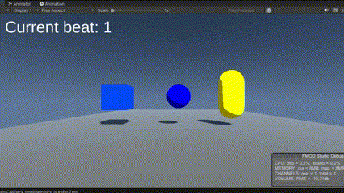

# Unity-Beat-FMOD
 Beat tracking system in Unity

This repo has been created to be able to trigger FMOD events depending on sound/music rhythm.

## Showcase
|Style|Image|
|:--:|:--:|
|Beat Tracking | |

## Overview
Currently:
- An event can be triggered on specified beats.
- Triggering according to marker specified in FMOD.

Will be added:
- Upbeat & downbeat
- Indicator to see the next beat.
